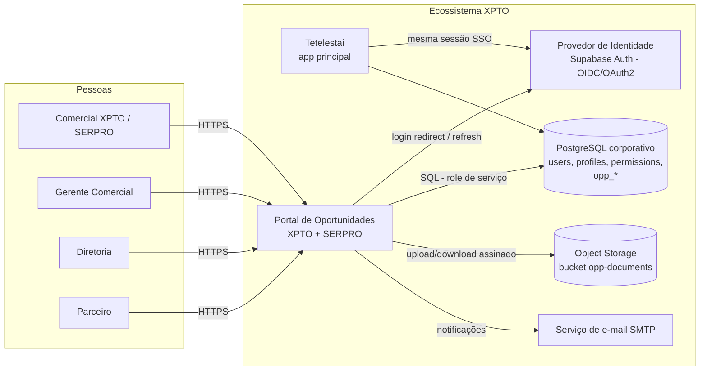
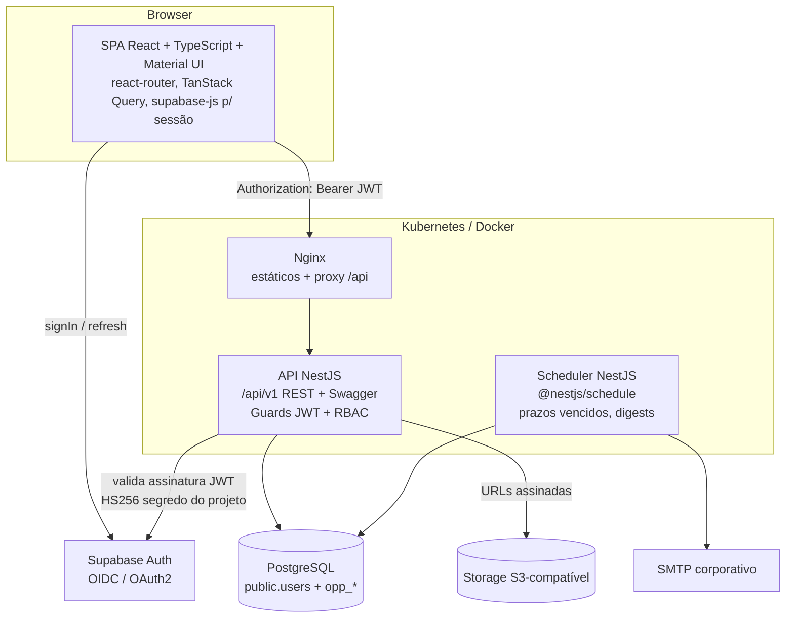

# 01 — Arquitetura da Solução

## 1. Visão geral

O Portal de Oportunidades XPTO + SERPRO é uma **micro aplicação** do ecossistema corporativo XPTO.
O ecossistema hoje é composto por micro-apps (TETELESTAI, MANNA, TIKKUN, BNEI, MERKAVAH, JIREH,
SPHRAGIS) que compartilham **um único PostgreSQL corporativo (Supabase)**, **uma única tabela de
identidade (`public.users`)** e **um único provedor de sessão (Supabase Auth/GoTrue)**. O SSO entre
as aplicações é a sessão GoTrue compartilhada; a autorização é centralizada nas tabelas
`profiles` / `permissions` / `profile_permissions`.

O portal adere a esse contrato e, ao mesmo tempo, introduz a camada de API dedicada exigida pelos
requisitos não funcionais (NestJS + REST/OpenAPI), que as demais micro-apps não possuem.

### Decisão de arquitetura (ADR-001): API NestJS sobre o Postgres corporativo

| Alternativa | Avaliação |
|---|---|
| SPA direto no PostgREST (padrão das outras micro-apps) | Integra naturalmente, mas não atende os RNFs (NestJS, REST/OpenAPI, Docker/K8s) nem centraliza a regra crítica de bloqueio de etapa em código de aplicação testável |
| **NestJS + PostgreSQL corporativo (escolhida)** | Atende os RNFs; valida o JWT GoTrue (SSO real, sem autenticação própria); regras de governança (checklist, transição, auditoria) ficam no servidor; usa a base de usuários/perfis existente por leitura direta |
| NestJS + banco próprio + sincronização de usuários | Viola o requisito "consumir usuários da base existente"; cria dessincronização e segundo ponto de verdade |

Consequências: o backend conecta no mesmo Postgres com uma credencial de serviço própria
(role dedicada `portal_oportunidades_api`), enxerga as tabelas compartilhadas em **somente leitura**
(`users`, `profiles`, `permissions`, `profile_permissions`) e é dono das tabelas `opp_*`.
A autorização efetiva é sempre aplicada na API (o front apenas oculta navegação).

### Decisão de arquitetura (ADR-002): tabelas com prefixo `opp_` no schema compartilhado

Segue a convenção do ecossistema (`todo_*`, `improvement_*`, `org_*`...): prefixo por módulo no
schema `public`, FKs para `public.users`, migration numerada e idempotente em
`supabase/migrations/`, RLS habilitado. Assim o portal permanece consultável pelos mecanismos
transversais já existentes (auditoria corporativa, relatórios cross-app, `pg_cron`).

### Decisão de arquitetura (ADR-003): defesa em profundidade — API + RLS

Mesmo com a API como caminho oficial, as tabelas `opp_*` recebem políticas RLS. Se algum cliente
futuro (ou as demais micro-apps) acessar via PostgREST, o banco continua negando o que a API
negaria. A regra de bloqueio de transição também existe como trigger no banco (`RN-001` em
`0073_portal_oportunidades.sql`), de modo que **nenhum caminho de escrita** consegue avançar etapa
sem checklist completo.

## 2. Diagrama de contexto (C4 — nível 1)

## 3. Diagrama de contêineres (C4 — nível 2)

## 4. Componentes do backend (C4 — nível 3)

| Módulo NestJS | Responsabilidade |
|---|---|
| `AuthModule` | Estratégia JWT (valida token GoTrue), resolve `public.users` + permissões; guards `JwtAuthGuard` e `PermissionsGuard` |
| `UsersModule` | Leitura da base compartilhada de usuários/perfis (read-only) |
| `StagesModule` | CRUD de etapas configuráveis e templates de checklist (perfil administrador) |
| `OpportunitiesModule` | CRUD de oportunidades, **transição de etapa com validação do checklist**, histórico, comentários |
| `DocumentsModule` | Upload, download, versionamento, aprovação/rejeição, histórico |
| `ChecklistModule` | Status consolidado do checklist por oportunidade/etapa |
| `DashboardModule` | Indicadores executivos (pipeline, funil, conversão, rankings, previsão) |
| `NotificationsModule` | Notificações internas + fila de e-mail |
| `AuditModule` | Trilha de auditoria (interceptor global + consulta) |
| `ClientsModule` / `PartnersModule` | Cadastros de clientes/órgãos e parceiros |

Corte transversal:

- `AuditInterceptor` — registra toda mutação (quem, quando, entidade, campo, valor anterior/novo).
- `TransactionService` — mutações de negócio (transição, aprovação) em transação única.
- Validação com `class-validator` em todos os DTOs; erros normalizados (RFC 7807 problem+json).

## 5. Fluxo de autenticação (SSO — sem autenticação própria)

1. O usuário acessa o portal; a SPA verifica sessão GoTrue existente (mesma sessão usada pelo
   Tetelestai quando servidos sob o mesmo domínio/projeto de identidade).
2. Sem sessão → redirect para o login corporativo (GoTrue; futuramente Entra ID via provider OIDC,
   herdado por todas as micro-apps de uma só vez).
3. A SPA envia o `access_token` como `Authorization: Bearer` em toda chamada à API.
4. A API valida assinatura/expiração/audience do JWT, resolve `auth_user_id → public.users` e
   carrega perfil + permissões (cache em memória de 60 s).
5. Usuário inexistente na base, bloqueado ou inativo → `403`. O portal **nunca cria usuários nem
   armazena senhas**.

Detalhes e alternativa Entra ID: ver `12-integracao-tetelestai.md`.

## 6. Requisitos não funcionais — atendimento

| RNF | Como é atendido |
|---|---|
| React + TypeScript + Material UI | `frontend/` (Vite + MUI v6) |
| Node.js + NestJS | `backend/` (NestJS 10, TypeORM) |
| PostgreSQL | Postgres corporativo; DDL em `supabase/migrations/0073_portal_oportunidades.sql` |
| OAuth2 / OpenID Connect | Validação de bearer token GoTrue (OIDC-compatível); zero credenciais locais |
| Docker | `backend/Dockerfile`, `frontend/Dockerfile`, `docker-compose.yml` |
| Kubernetes Ready | `k8s/` — deployments stateless, probes, config por env, HPA-ready |
| REST + OpenAPI/Swagger | `@nestjs/swagger`; UI em `/api/docs`, spec em `/api/docs-json` |

## 7. Segurança

- TLS em todas as bordas; cookies/token apenas em memória da SPA (sessão gerida pelo supabase-js).
- API sem estado (JWT), horizontalmente escalável.
- Segredos via env/Secrets do K8s (`SUPABASE_JWT_SECRET`, `DATABASE_URL`, `STORAGE_*`), nunca em código.
- Uploads: extensões/MIME permitidos por configuração, tamanho máximo, antivírus plugável
  (roadmap), URLs de download assinadas e expiráveis.
- Rate limiting (`@nestjs/throttler`) e CORS restrito aos domínios corporativos.
- Auditoria imutável: `opp_audit_log` é append-only (sem UPDATE/DELETE — revogado + trigger).

## 8. Observabilidade

- Logs estruturados JSON (pino) com `request_id` e `user_id`.
- `/health` (liveness) e `/health/ready` (readiness: ping no Postgres).
- Métricas Prometheus (`/metrics`) — latência por rota, erros, tamanho do pipeline (roadmap M2).
