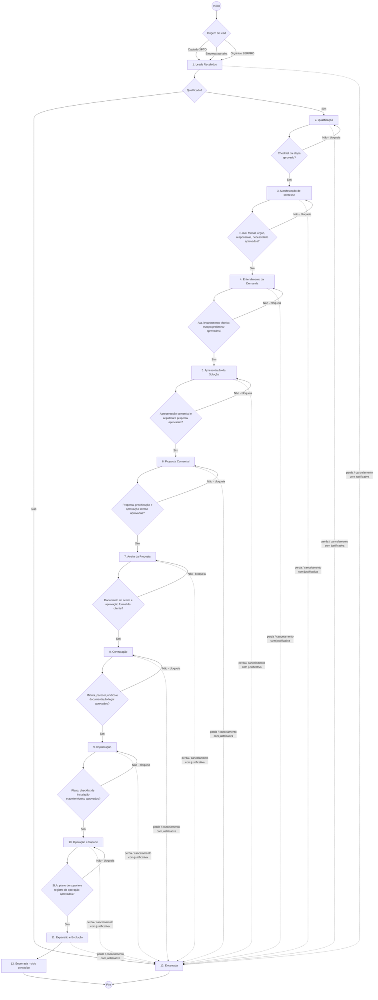
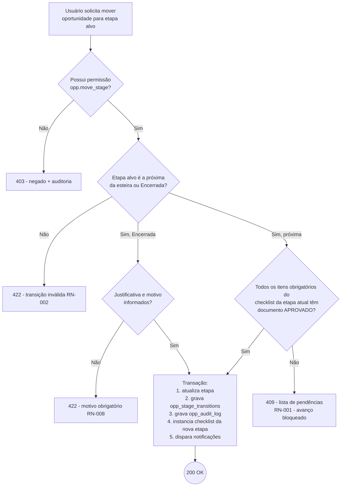
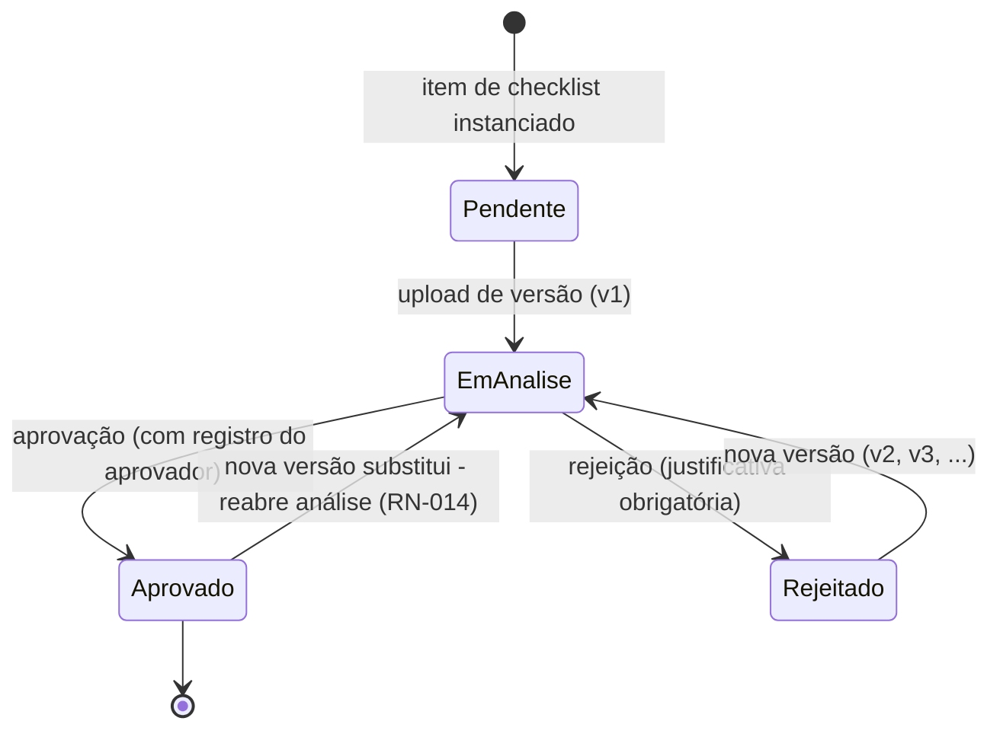

# 02 — Fluxograma BPMN do Processo Comercial

## 1. Processo macro (pool única, 12 etapas)

O processo é uma esteira sequencial com **gateways de governança documental** entre as etapas:
a transição N → N+1 só ocorre quando todos os itens obrigatórios do checklist da etapa N estão
com documento **aprovado** (RN-001). Qualquer etapa pode desviar para **Encerrada** com motivo
(perdida, cancelada, sem interesse — RN-008).

## 2. Subprocesso: transição de etapa (executado pela API a cada tentativa)

## 3. Subprocesso: ciclo de vida de um documento

## 4. Raias (responsabilidades por etapa — visão BPMN de lanes)

| Etapa | Lane principal | Apoio |
|---|---|---|
| Leads Recebidos, Qualificação | Comercial XPTO / SERPRO | Parceiro (quando origem parceira) |
| Manifestação de Interesse, Entendimento da Demanda | Comercial responsável | Cliente/órgão (documentos de entrada) |
| Apresentação da Solução, Proposta Comercial | Comercial + Gerente Comercial | Pré-vendas/técnico |
| Aceite, Contratação | Gerente Comercial | Jurídico (parecer), Diretoria (aprovação interna) |
| Implantação | Gestor técnico | Comercial (acompanhamento) |
| Operação/Suporte, Expansão | Gestor de operação | Comercial (upsell) |

A aprovação de documentos exige `opp.doc.approve` (por padrão Gerente Comercial, Diretor e
Administrador) — quem faz upload não aprova o próprio documento (RN-013).
