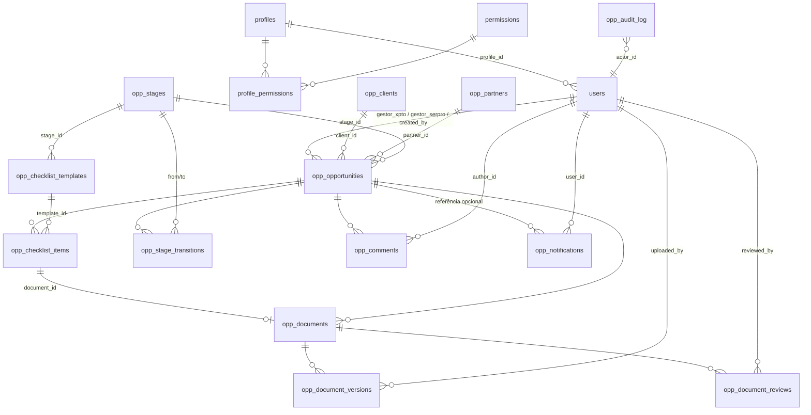

# 03 — Modelo de Dados (DER + Dicionário)

O portal **reutiliza** as entidades de identidade/RBAC da base corporativa compartilhada
(`users`, `profiles`, `permissions`, `profile_permissions`) e é **dono** das tabelas prefixadas
`opp_`. DDL oficial: `supabase/migrations/0073_portal_oportunidades.sql`.

## 1. DER completo

`opp_audit_log` referencia qualquer entidade `opp_*` por (`entity`, `entity_id`) — trilha
polimórfica append-only.

## 2. Dicionário de dados

### 2.1 Compartilhadas (somente leitura pelo portal)

| Tabela | Uso pelo portal |
|---|---|
| `users` | Identidade (resolvida por `auth_user_id = auth.uid()`), nome, e-mail, ativo/bloqueado |
| `profiles` | Perfil do usuário (`level`, nome) |
| `permissions` / `profile_permissions` | Permissões `opp.*` (seed na migration 0073) |

### 2.2 `opp_stages` — etapas configuráveis da esteira

| Coluna | Tipo | Regra |
|---|---|---|
| `id` | bigint PK | |
| `code` | text UNIQUE | ex.: `lead`, `qualificacao`, `interesse`... |
| `name` | text NOT NULL | rótulo exibido |
| `position` | int NOT NULL UNIQUE | ordem na esteira; transição válida = `position + 1` (RN-002) |
| `color` | text | cor da coluna no Kanban |
| `is_terminal` | boolean default false | `true` apenas em Encerrada |
| `active` | boolean default true | etapas podem ser desativadas, nunca excluídas com histórico |
| `created_at` / `updated_at` | timestamptz | |

### 2.3 `opp_checklist_templates` — checklist parametrizável por etapa

| Coluna | Tipo | Regra |
|---|---|---|
| `id` | bigint PK | |
| `stage_id` | FK `opp_stages` | |
| `name` | text NOT NULL | ex.: "E-mail formal do cliente" |
| `description` | text | orientação ao usuário |
| `doc_category` | text | categoria sugerida do documento |
| `required` | boolean default true | somente `required=true` bloqueia avanço |
| `position` | int | ordem de exibição |
| `active` | boolean default true | desativação preserva itens já instanciados |

### 2.4 `opp_clients` — clientes / órgãos públicos

`id`, `name` (razão social), `orgao` (órgão/entidade), `cnpj` (validado, único quando informado),
`municipio`, `uf` (char 2), `contact_name`, `contact_email`, `contact_phone`, `notes`,
`active`, `created_by` FK users, timestamps.

### 2.5 `opp_partners` — empresas parceiras

`id`, `name`, `cnpj`, `contact_name`, `contact_email`, `contact_phone`, `active`,
`created_by`, timestamps.

### 2.6 `opp_opportunities` — oportunidade (agregado raiz)

| Coluna | Tipo | Regra |
|---|---|---|
| `id` | bigint PK | |
| `code` | text UNIQUE | gerado: `OPP-AAAA-NNNN` (sequence por ano) |
| `lead_source` | enum `xpto` \| `parceiro` \| `serpro` | origem do lead |
| `client_id` | FK `opp_clients` NOT NULL | cliente/órgão |
| `partner_id` | FK `opp_partners` NULL | obrigatório quando `lead_source='parceiro'` (RN-005) |
| `objeto` | text NOT NULL | objeto da contratação |
| `solucao` | text NOT NULL | solução ofertada |
| `valor_estimado` | numeric(15,2) | ≥ 0 |
| `receita_prevista` | numeric(15,2) | ≥ 0 |
| `probabilidade` | int | 0–100 (%) |
| `complexidade` | enum `baixa` \| `media` \| `alta` | |
| `situacao_comercial` | text | situação livre/negociação |
| `stage_id` | FK `opp_stages` NOT NULL | etapa atual |
| `status` | enum `aberta` \| `ganha` \| `perdida` \| `cancelada` | RN-008 |
| `closure_reason` | text | obrigatório quando status ≠ aberta |
| `gestor_xpto_id` | FK `users` NOT NULL | responsável comercial XPTO |
| `gestor_serpro_id` | FK `users` NULL | gestor SERPRO |
| `expected_close_date` | date | prazo estimado de fechamento |
| `prazo_estimado` | text | prazo estimado de execução |
| `observacoes` | text | |
| `created_by` FK users, `created_at`, `updated_at` | | auditoria mínima embutida |

### 2.7 `opp_checklist_items` — instância do checklist na oportunidade

Criados automaticamente ao entrar em cada etapa (a partir dos templates ativos da etapa).

`id`, `opportunity_id` FK, `template_id` FK, `stage_id` FK (denormalizado p/ consulta),
`name` (congelado do template), `required` (congelado), `document_id` FK `opp_documents` NULL,
`status` enum `pendente` | `em_analise` | `aprovado` | `rejeitado` | `dispensado`,
`waived_by`/`waived_reason` (dispensa exige `opp.checklist.waive`, RN-009), timestamps.
UNIQUE (`opportunity_id`, `template_id`).

### 2.8 `opp_documents` — documento lógico

`id`, `opportunity_id` FK, `checklist_item_id` FK NULL (documento pode ser avulso),
`name`, `category`, `doc_type`, `status` enum `em_analise` | `aprovado` | `rejeitado`,
`current_version` int default 1, `notes`, `created_by`, timestamps.

### 2.9 `opp_document_versions` — versionamento físico

`id`, `document_id` FK, `version` int (UNIQUE por documento), `file_name`, `mime_type`,
`size_bytes`, `storage_path` (bucket `opp-documents`), `observacoes`, `uploaded_by` FK users,
`uploaded_at`. **Imutável** — nova versão = nova linha; download sempre por URL assinada.

### 2.10 `opp_document_reviews` — aprovações/rejeições

`id`, `document_id` FK, `version` int, `action` enum `aprovado` | `rejeitado`,
`justification` (obrigatória em rejeição, RN-012), `reviewed_by` FK users, `reviewed_at`.

### 2.11 `opp_stage_transitions` — histórico de fases

`id`, `opportunity_id` FK, `from_stage_id` FK NULL (criação), `to_stage_id` FK,
`moved_by` FK users, `moved_at`, `justification` (obrigatória em encerramento),
`snapshot` jsonb (valor/probabilidade no momento — alimenta tempo médio por etapa e conversão).

### 2.12 `opp_comments`

`id`, `opportunity_id` FK, `author_id` FK users, `body` text NOT NULL, `created_at`.
Edição não permitida; exclusão lógica (`deleted_at`) apenas pelo autor ou admin.

### 2.13 `opp_notifications`

`id`, `user_id` FK users (destinatário), `type` enum (`nova_oportunidade`, `mudanca_etapa`,
`documento_pendente`, `documento_rejeitado`, `aprovacao_necessaria`, `contratacao_proxima`,
`prazo_vencido`), `title`, `body`, `opportunity_id` FK NULL, `read_at` NULL,
`email_sent_at` NULL (controle do canal e-mail), `created_at`.

### 2.14 `opp_audit_log` — trilha de auditoria (append-only)

| Coluna | Tipo |
|---|---|
| `id` | bigint PK |
| `entity` | text (`opportunity`, `document`, `checklist_item`, `stage`, `client`, ...) |
| `entity_id` | bigint |
| `opportunity_id` | bigint NULL (índice para timeline da oportunidade) |
| `action` | text (`create`, `update`, `transition`, `upload`, `approve`, `reject`, `waive`, `delete`) |
| `field` | text NULL (nome do campo alterado) |
| `old_value` / `new_value` | text NULL |
| `actor_id` | FK `users` |
| `metadata` | jsonb (ip, user-agent, request_id) |
| `occurred_at` | timestamptz default now() |

Sem UPDATE/DELETE (revogados + trigger de proteção). Detalhes em `13-auditoria-compliance.md`.

## 3. Índices principais

- `opp_opportunities (stage_id)`, `(status)`, `(gestor_xpto_id)`, `(client_id)`,
  `(expected_close_date) where status='aberta'` — Kanban, dashboards e vencidas.
- `opp_checklist_items (opportunity_id, stage_id)` — validação de transição.
- `opp_audit_log (opportunity_id, occurred_at desc)` e `(entity, entity_id)` — timeline.
- `opp_notifications (user_id) where read_at is null` — badge de não lidas.

## 4. Integridade além de FKs

- Trigger `opp_guard_stage_transition`: rejeita UPDATE de `stage_id` se houver item obrigatório
  não aprovado/dispensado na etapa atual (RN-001 no banco — defesa em profundidade).
- Trigger `opp_instantiate_checklist`: ao entrar numa etapa, cria os `opp_checklist_items`
  faltantes a partir dos templates ativos.
- Trigger `opp_audit_protect`: bloqueia UPDATE/DELETE em `opp_audit_log`.
- CHECKs: `probabilidade between 0 and 100`, valores ≥ 0, `uf ~ '^[A-Z]{2}$'`,
  parceiro obrigatório quando `lead_source='parceiro'`.
